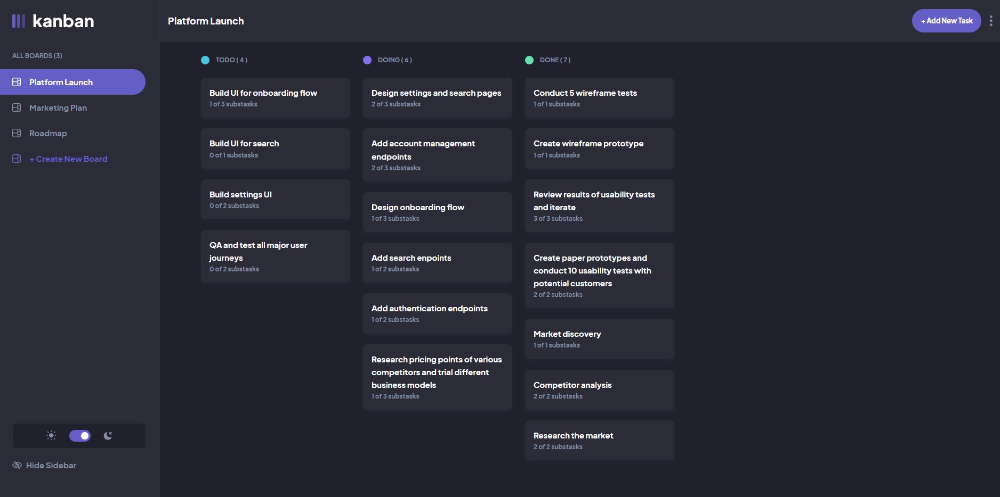

## Table of contents

- [Overview](#overview)
  - [The challenge](#the-challenge)
  - [Screenshot](#screenshot)
  - [Links](#links)
- [My process](#my-process)
  - [Built with](#built-with)
- [Author](#author)

## Overview

### The challenge

Users should be able to:

- View the optimal layout for the app depending on their device's screen size
- See hover states for all interactive elements on the page
- Create, read, update, and delete boards and tasks
- Receive form validations when trying to create/edit boards and tasks
- Mark subtasks as complete and move tasks between columns
- Hide/show the board sidebar
- Toggle the theme between light/dark modes
- Keep track of any changes, even after refreshing the browser
### Screenshot

### Links

- Solution URL: [FrontendMentor](https://www.frontendmentor.io/solutions/kanban-task-management-with-vue-and-tailwind-kNMCbZs_ea)
- Live Site URL: [Netlify](https://kanban-task-management.netlify.app)

## My process

### Built with

- Vue 3
- Tailwind

## Author

- Frontend Mentor - [@UnTalPeluca](https://www.frontendmentor.io/profile/yourusername)
- Github - [@UnTalPeluca](https://github.com/UnTalPeluca)
